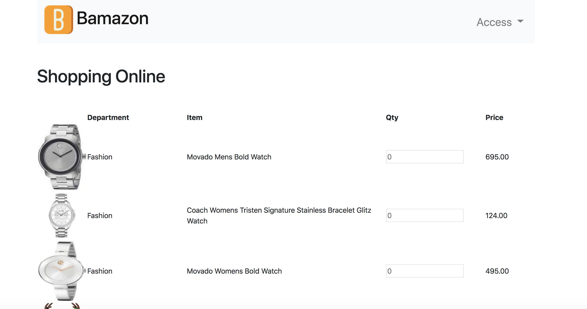
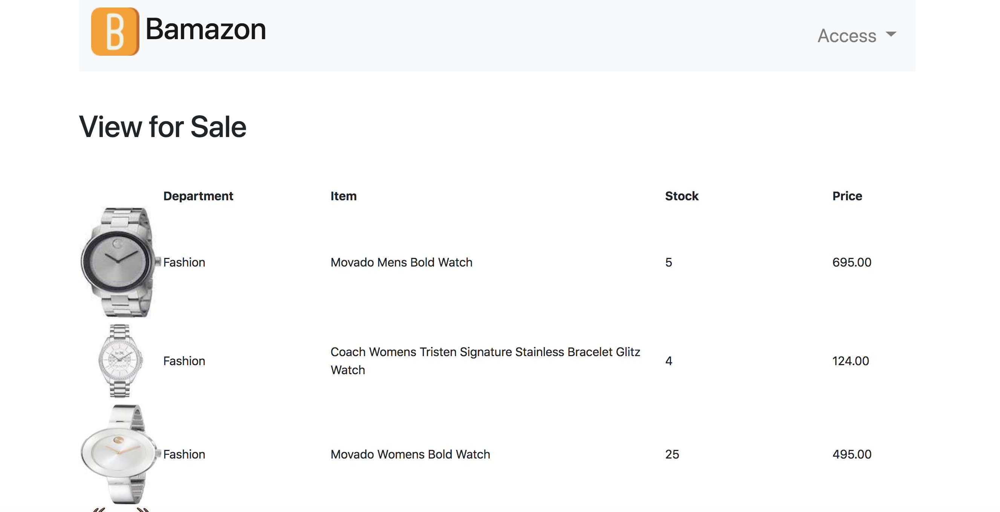
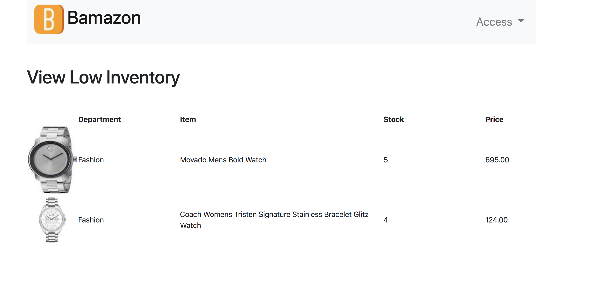
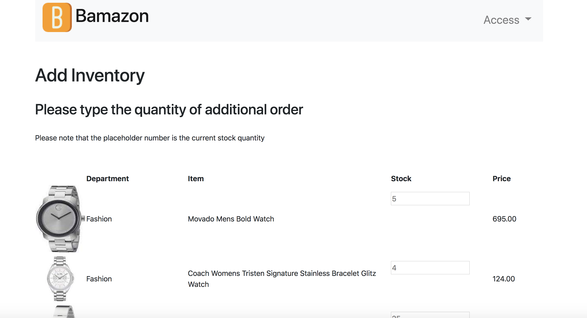
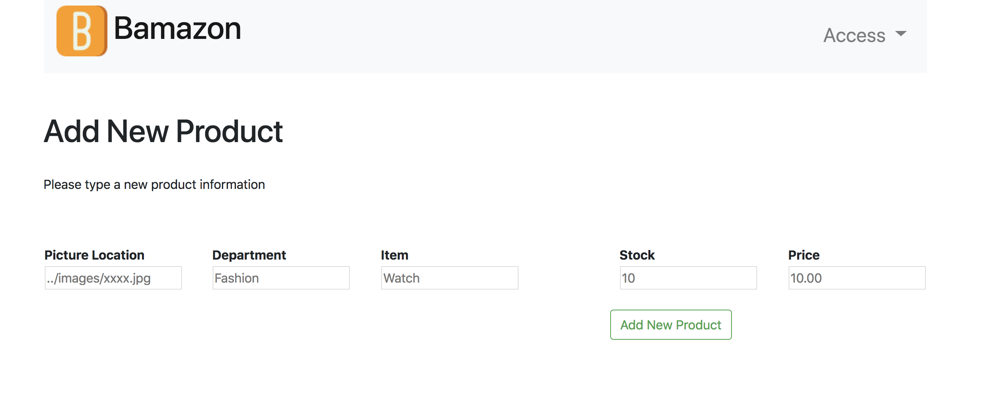
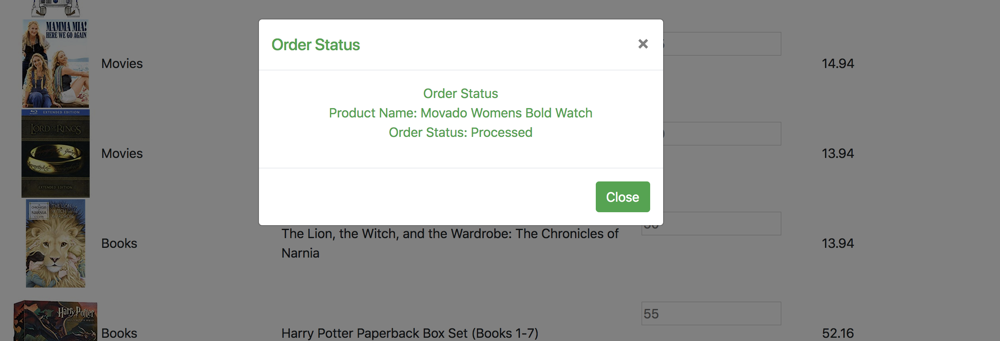

# bamazon

## Description
--- 
This is a mock online site and display a page based on a role.

## Technology
--- 
* Web Server: Heroku
* DB: JawsDB and MySQL
* Language: Javascript

## Structure of File
--- 
* Under config folder 

    * config.json: DB setup

* Under models folder

    * Department.js: Creates a table called Departments that contains department_name, and over_head_costs.

    * index.js: server setup

    * Product.js: Creates a table called Products that contains, product_name, department_name, price, stock_quantity, picture, and product sales.

* Under public folder

    * css.js: My custom style sheet
    * images folder: all pictures used
    * addNewOrder.js: Request to add a new product by a manager.
    * addOrder.js: Request to update the inventory.
    * app.js: Event handler for the index.html
    * managerView.js: Request to view the information for a manager.
    * modalDisplay: Display a modal window for the status of order and product.
    * orderDisplay.js: Display the cutomer site dynamically.
    * index.html: The home html file.

* Under routes folder(Server side)

    * api-order.js: Process the customer's order and the create a status reply for a customer
    * api-routes.js: Process GET & PUT request from the customer.
    * api-sales-routes.js: Process GET, PUT, POST request from  a manager.
    * api-stock.js: Process the stock update request and reply back to the customer.
    * html-route.js: Displays the index.html file

* Under seeds folder

    * schema.sql: Creates a DB
    * seed-db.sql: Seeds data for the DB.

* env file: URL for DB
* server.js: Starts up a server. 

## *How to Use* 
___ 

1. 1. Go to this URL to access this program ([Bamazon Customer Page](https://nameless-taiga-74435.herokuapp.com))

You can type the quantity and press button to order.

2. From Access dropdown box, select View for Sale where you can view the current stock information. This is for the manager

3. From Access drop down box, select View Low Inventory. This will display the iventories lower than 5.

4. From Access drop down box, select Add Inventory to be able to add additional stock order.

5. From Access dropdown box, select Add New Product. This site will be add a new product by the manager.

6. If the order was processed, it will be notified.

## Ice Box
--- 
Create the Supervisor role:
* View Product Sales by Department
   
* Create New Department

## Author
--- 
Makiko Vaughan(makiko.vaughan@gmail.com)